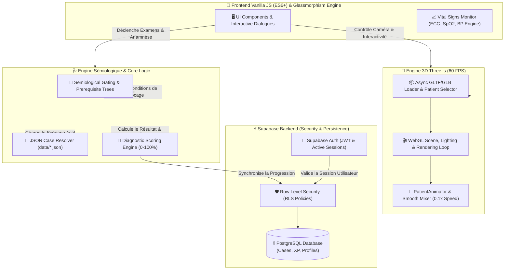

<h1 align="center">🎮 Medgame — Next-Gen Clinical Medical Simulation Engine</h1>

<p align="center">
  <b>Plateforme d'apprentissage immersif et de simulation sémiologique en 3D WebGL pour étudiants en médecine et professionnels de santé.</b>
</p>

<p align="center">
  <a href="https://github.com/DocteurWu/medgame/blob/main/LICENSE"></a>
  <a href="https://threejs.org/"></a>
  <a href="https://developer.mozilla.org/en-US/docs/Web/JavaScript"></a>
  <a href="https://supabase.com/"></a>
  <a href="https://docker.com"></a>
</p>

---

## ⚡ En Bref

> **Simulation Clinique Immersive :** Simulation d'urgence et d'anamnèse en environnement 3D WebGL fluide à 60 FPS, moniteurs de constantes vitables réactifs (ECG, SpO2, PA) et moteur de sémiologique interactive avec système de verrous (gating).

---

## 📊 Section Métriques & Performance

<div align="center">

| 📑 Cas Cliniques | 🎮 Performance 3D | ⚡ Framework Overhead | 📱 Accessibilité |
| :---: | :---: | :---: | :---: |
| **120+ Clinical Cases** | **60 FPS WebGL Engine** | **0 External Overhead** | **PWA Ready** |
| *Banque sémiologique complète (Cardio, Neuro, Pneumo...)* | *Moteur 3D Three.js sans lag ni saccade* | *Code 100% Vanilla JS ultra-léger et rapide* | *Progressive Web App installable hors-ligne* |

</div>

---

## 🏗️ Architecture System & Interaction

Le schéma ci-dessous illustre le flux complet d'interaction entre l'interface utilisateur **Frontend Vanilla**, le moteur **3D Three.js**, l'engine **Sémiologique** et le backend **Supabase Security/RLS**.



---

## 🌟 Fonctionnalités Clés

- 🏥 **Consultation & Examen Physique 3D** : Exploration interactive de la chambre d'examen avec visualisation dynamique du patient selon l'âge, le sexe et la pathologie.
- 💓 **Moniteur de Constantes en Temps Réel** : Tracé ECG dynamique, saturation SpO2 et pression artérielle générés avec effets visuels fluides.
- 🔐 **Engine Sémiologique & Système de Gating** : Progression conditionnée par la logique clinique (impossible d'ordonner un examen sans justification prioritaire).
- ✏️ **Éditeur de Cas Intégré** : Interface auteur permettant de créer, tester et publier de nouveaux cas cliniques en communauté.
- 🏆 **Gamification & Niveaux de Progression** :
  - **Niveau 1 (Externe)** : Résolution des cas cliniques validés.
  - **Niveau 2 (Interne - 1500 XP)** : Déblocage de l'Éditeur pour soumettre ses propres scénarios.
  - **Niveau 5 (Professeur)** : Droit de validation et peer-review sur la banque de cas.
- ⏱️ **Mode Urgence Chronométré** : Mises en situation sous haute pression de temps avec décision rapide requis.

---

## 🛠️ Tech Stack & Choix d'Ingénierie

| Composant | Technologie | Description |
| :--- | :--- | :--- |
| **Frontend UI** | HTML5 / Vanilla CSS3 / ES6+ | Zero bundler overhead, chargement instantané, styles glassmorphism. |
| **3D Engine** | Three.js (r128) + GLTFLoader | Modèles 3D patients Kenney optimisés GLB à faible empreinte mémoire. |
| **Visual Effects** | GSAP (GreenSock) | Animations fluides des courbes vitales et fenêtres modales. |
| **Backend & Auth** | Supabase (PostgreSQL + RLS) | Sécurité fine par règles RLS sur les cas `published` vs `pending`. |
| **Conteneurisation** | Docker / Nginx Alpine | Image ultra-légère multi-architecture (x86_64, ARM64 / Orange Pi / Raspberry Pi). |

---

## 🚀 Installation & Démarrage Rapide

### 1. Développement Local (Sans étape de Build)

```bash
# 1. Cloner le dépôt GitHub
git clone https://github.com/DocteurWu/medgame.git
cd medgame

# 2. Lancer un serveur Web local
# Via Node.js:
npx serve .

# Ou via Python:
python -m http.server 8888
```

Ouvrez ensuite votre navigateur sur `http://localhost:8888`.

### 2. Déploiement via Docker

```bash
# Construire l'image Docker optimisée
docker build -t medgame .

# Lancer le conteneur sur le port 8888
docker run -d -p 8888:8888 --name medgame-app medgame
```

---

## 🔐 Sécurité & Architecture RLS (Supabase)

L'accès à la base de données est sécurisé au niveau des lignes de tables via **Row Level Security (RLS)** sur PostgreSQL :

- 🔓 **Cas Publics (`status = 'published'`)** : Accessibles en lecture à tous les étudiants (connectés ou invités).
- 🔒 **Cas en Révision (`status = 'pending'`)** : Uniquement visibles par leur auteur et les comptes reviewers / administrateurs.
- 👤 **Profils & Progression (`user_progress`)** : Chaque utilisateur ne peut modifier que son propre niveau, XP et historique.

---

## 🤝 Contributions & Directives

Les contributions de la communauté médicale et dev sont vivement encouragées ! 

1. **Création de Cas Cliniques** : Suivez la convention de nommage `{SPECIALITE}_{condition}_{patient}.json` dans le dossier `data/`.
2. **Améliorations UI / 3D Engine** : Proposez vos Pull Requests directement sur la branche principale.

Merci de consulter le guide [CONTRIBUTING.md](file:///c:/Users/Louaï/Desktop/medgame-main/CONTRIBUTING.md) pour plus de détails.

---

## 📄 Licence & Crédits

- **Code Source** : Distribué sous licence [GNU General Public License v3.0 (GPLv3)](file:///c:/Users/Louaï/Desktop/medgame-main/LICENSE).
- **Modèles 3D Patients & Mobilier** : Licences CC0 / CC-BY (Assets Kenney 3D). Voir les crédits complets dans [ATTRIBUTIONS.md](file:///c:/Users/Louaï/Desktop/medgame-main/ATTRIBUTIONS.md).

---

<p align="center">
  Développé avec 💖 pour la communauté médicale et scientifique • <b>Medgame Team</b>
</p>